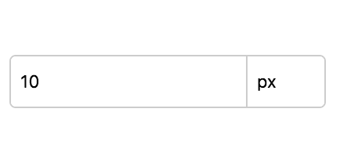
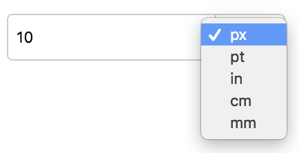

# React Number Input

[![Npm Version][npm-version-image]][npm-version-url]
[![License][license-image]][license-url]

## Screenshots




## Install

```
npm i @fiveem/react-number-input
```

## Usage

```JSX
import NumberInput from '@fiveem/react-number-input'

<NumberInput name="value" min="0" max="20" value={this.state.value} onChange={this.onNumberInputChange} />
```

## API
|name|type|sample value|description|
|----|----|------------|-----------|
|value|String|`10px`|input value|
|units|Array|`['px', 'pt', 'cm']`|array of allowed units; default: `['px', 'pt', 'in', 'cm', 'mm']`|
|name|String|`number`|input label name; default value: `number`|
|onChange|Function||event triggered when value change|

## Models

### Event

```
{
    name: "number"
    value: "1px"
}
```

## License

react-number-input is released under the MIT license.